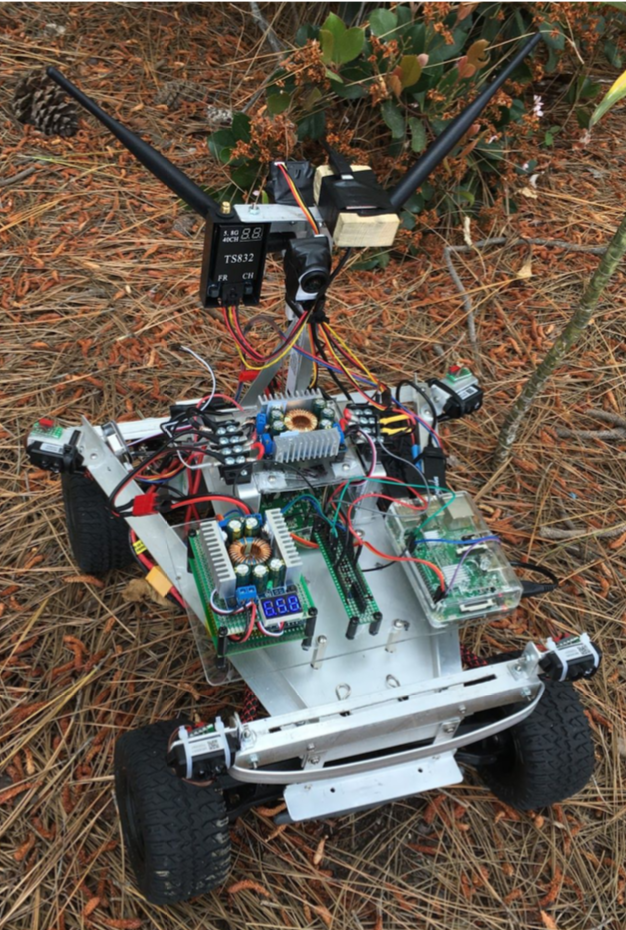
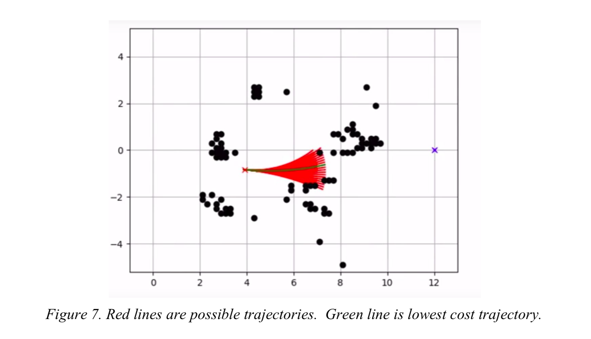
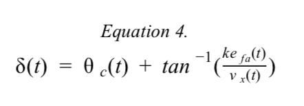
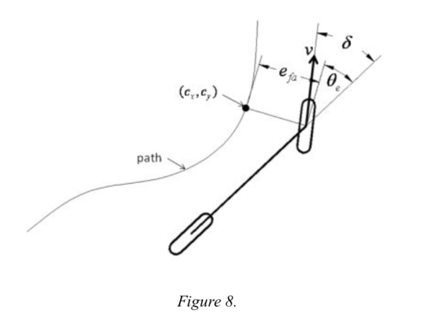
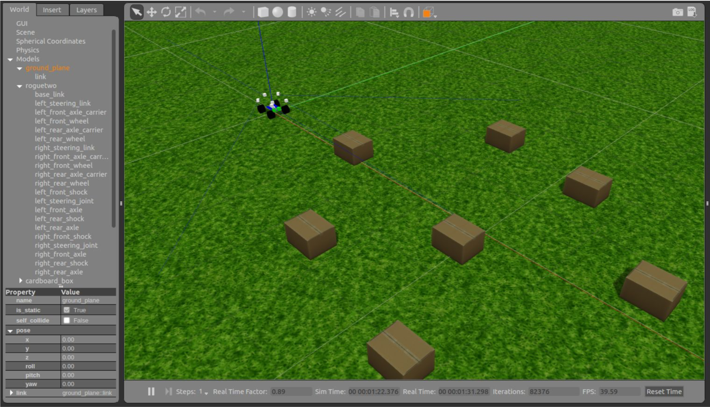

# Rouge Two

SDSU Spring 2018 Senior Design Project

## To Build

- git clone https://github.com/RyanMorris95/roguetwo_ws.git
- cd roguetwo_ws
- catkin_make
- source devel/setup.bash

## To Run Simulation

- Run roscore
- roslaunch roguetwo_gazebo roguetwo.launch

## To Run Rviz

- roslaunch roguetwo_description roguetwo_rviz.launch

## Abstract

There are situations, such as during a natural disaster, when human eyes are needed, but it is not safe for a human to physically go to a scene. This problem calls for the development of new technologies, and this project aims to answer that call. The rover detailed in this report not only provides the crucial ability for a person to view a scene remotely via first person camera, but also has the capability to return to a designated home base autonomously when triggered to do so. Through careful planning and design, this rover brings forth new opportunities to see that which under normal circumstances, cannot be seen.

## Competition

This project was completed partly as a competition with another team creating another autonomous rover. Thus, there were certain agreed upon specifications and terms, both for the design of the rover itself and the rules and setup of the competition day.
First, the rover itself must not exceed 1.5 cubic feet in size, and must be under 50 pounds. The rover must be able to drive or be driven for a minimum of 15 minutes before needing a new battery. The challenge also specified that the maximum budget for the project is \$1000.
On the day of the challenge, there will be a field of 8 boxes placed on a field that is 30 feet by 30 feet (see Figure 1). The boxes will be 12 inches in length and width, 18 inches tall, and at least 4 feet apart. They will be placed perpendicular to the starting line as well. Each team will have three attempts to make it across the field and back, with a timer running for each run. The car will be driven to from home base to the other other side of the field by a driver who is facing away from the field. Then the car will return autonomously to the home base. The person with the best time wins the competition.

## Hardware Architecture

The basis for the rover was a pre-built RC Car that was then restructured to fit the needs of the project. A Raspberry Pi 3+ is the primary CPU device, and additionally the other primary parts of the project are the Lidar sensors, the Xbox controller, and camera. Below is a basic diagram of both how hardware was broken down for assigning and building, as well as a block diagram of the basic hardware setup.

## Software Architecture

Within ROS, the software was programmed in C/C++ as well as Python. C/C++ was used exclusively for navigation and perception, while Python was used for non-CPU intensive modules. In addition, since each node is node is ran as a separate process then all cores of the odroid could be taken advantage of. This allows the linux operating system to assign the cores and choose the task scheduling. By choosing specific languages for specific tasks, the software was optimized to take advantage of the the differing benefits of each language. Additionally, Gazebo was also used for producing simulations of the rover, allowing the project to run with hardware and software working in parallel. The simulations created utilizing ROS allowed the project to be jump started, as well as for a wider range of freedom to make mistakes without damaging any hardware.
The general layout of the software can be seen below, consisting of a navigation system, a perceptions system, a controls system, and a hardware communication system (see Figure 4). ROS has a tool that can plot all the nodes in the system and the connections between them. To see the complexity of our system at a lower level please refer to Figure 5.

## Mapping And Path Planning (roguetwo_navigation)

To achieve autonomous obstacle avoidance on the way back to home the rover would have to map its environment and dynamically plan a route around obstacles while still heading in the direction of home. The mapping was acomplished using four single beam lidars on each corner of the vehicle. As the vehicle is driving, anytime a lidar beam reads an obstacle less than X feet away, that obstacle is added to a 2D occupancy grid. Then to dynamically plan a route around that obstacle we use the dynamic window approach. This planning method creates a window of possible trajectories around the vehicle. Every possible trajectory within that window is given a cost. The trajectory with the lowest cost is then used. The screenshot below shows the finished product during one of our runs. As one can see, the vehicle chooses a clear and fast route to home.

## Path Following (roguetwo_control)

The planner will return a vector of x, y, and yaw states of the vehicle. It is now the path following node's job to take the vehicle's current position and compute a steering angle to follow that trajectory. The path tracking node uses the Stanley Method, which is a nonlinear feedback function of the cross track error measured from the center of the front axle to the neast path point. Equation 4 shows the steering control law equation.

The first part of the euqation simple keeps the wheels aligned with the given path by setting the steering angle to the heading error. The second part adjusts the steering angle so that the intended trajectory intersects the path. As the cross track error increases the wheels will be steered more aggressively to the path. For visual representation please see figure 8 below.

## Simulation (roguetwo_gazebo)

A crucial aspect of our testing and development is the Gazebo Simulation software. The most beneficial aspect of this software, is the opportunity for the coders to test their program and logic without requiring an actual field test. This is very impactful during the initial stages of development, when we have no actual hardware to test with, allowing the software and hardware teams to work in parallel.
Within Gazebo itself, we are able to simulate the rover, sensors, cameras, and the boxes as can be seen in figure 10. The white boxes surrounding the rover represent the lidar, and the blue lines protruding outwards are the range. Gazebo also allows us to easily reposition the rover, and the boxes, allowing us to test quickly and efficiently, multiple times.

[To read more about our project please check out our final report](./docs/final_report.pdf)

[To see a demo checkout this video of the vehicle autonomously returning home](./docs/trimmed_Video.mov)
